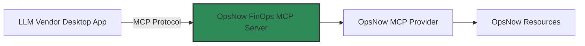

# OpsNow FinOps MCP Server

## 소개
OpsNow FinOps MCP(Module Context Protocol) Server는 Claude Desktop App과 같은 MCP Client에 OpsNow에서 제공하는 클라우드 비용과 클라우드 제품 사용량 데이터를 제공하는 서버입니다.

## 시스템 구조


- **LLM Vendor Desktop App**: Claude와 같은 LLM 기반 데스크톱 애플리케이션
- **OpsNow FinOps MCP Server**: Asset 및 Cost 데이터를 MCP 형식으로 제공하는 서버
- **OpsNow MCP Provider**: OpsNow API Bridge를 통해 자원 데이터를 처리
- **OpsNow Resources**: 실제 OpsNow 리소스 데이터를 가정한 목데이터로 구현 (개발 및 테스트 목적)

## 주요 기능

- MCP 프로토콜을 통한 데이터 제공
- OpsNow에서 제공하는 클라우드 비용과 클라우드 제품 사용량 데이터 제공
- MCP Client와의 효율적인 통신

## 기술 스택

- Node.js
- TypeScript
- MCP SDK (@modelcontextprotocol/sdk)
- dotenv
- zod
- axios

## 설치 방법

```bash
# 저장소 클론
git clone https://github.com/taejulee/opsnow-finops-mcp-server.git

# 의존성 설치
npm install

# 빌드
npm run build
```

## 환경 설정
프로젝트에 기본 `.env` 파일이 포함되어 있으며, 목데이터를 사용하도록 설정되어 있습니다. 필요한 경우 이 파일을 수정하여 실제 환경에 맞게 설정할 수 있습니다.

## 개발 환경 설정

### 필수 요구사항

- Node.js 18.x 이상
- npm 9.x 이상

## 사용 방법

### 비용 데이터 조회
```bash
# AWS 비용 조회
get-cost --vendor AWS --months 2025-06

# Azure 비용 조회
get-cost --vendor Azure --months 2025-06

# GCP 비용 조회
get-cost --vendor GCP --months 2025-06
```

### 사용량 데이터 조회
```bash
# AWS EC2 사용량 조회
get-usage --vendor AWS --product ec2

# Azure VM 사용량 조회
get-usage --vendor Azure --product vm

# GCP VM 인스턴스 사용량 조회
get-usage --vendor GCP --product vm_instance
```

## 라이선스
이 프로젝트는 MIT 라이선스 하에 배포됩니다.
